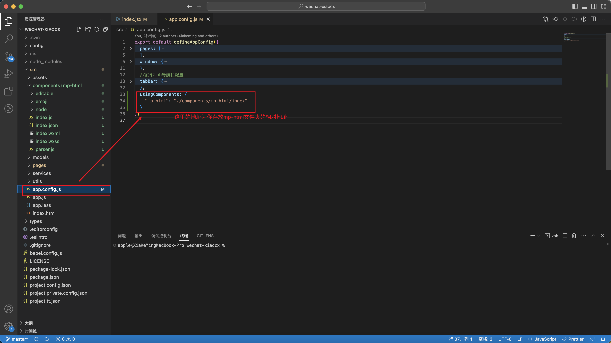

# Taro3-react-小程序 使用 第三方富文本 教程

## mp- html [官方网站]([小程序富文本组件 (gitee.io)](https://jin-yufeng.gitee.io/mp-html/#/))

### 1.下载源文件


### 2.将对应文件放入到项目中

#### 要放的文件夹


#### 放到项目中

创建components文件夹将**mp-weixin**放到该目录下并且改名为**mp-html**


#### 编辑文件


##### 编辑文件的内容



```js
	usingComponents: {
    "mp-html": "./components/mp-html/index"
  }
```

#### 接下来根据官方文档的微信小程序使用教程来使用就可以了

### 3.使用插件（如编辑富文本）

- 编辑文本

  

- 安装依赖 重新打包

  

```bash
# 安装依赖
# 通过 npm 安装
npm install
# 或通过 yarn 安装
yarn
```

```bash
# 生成微信包到 dist/mp-weixin
npm run build:weixin
```

### 3.重新按照上面的步骤重新将打包好的文件夹放到项目中就可以了

**注意** 使用组件时不需要导入使用的文件中是全局导入的
